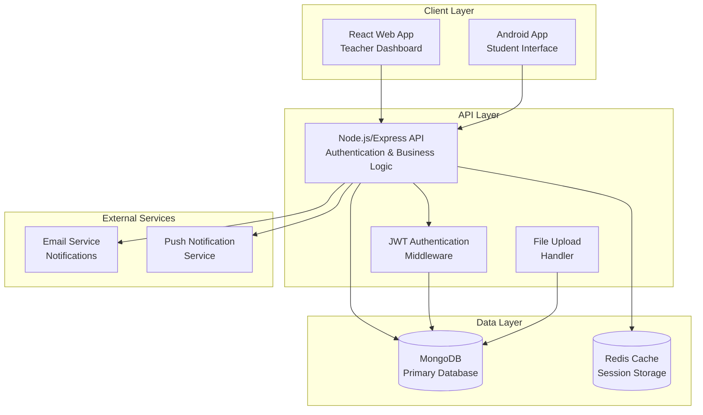
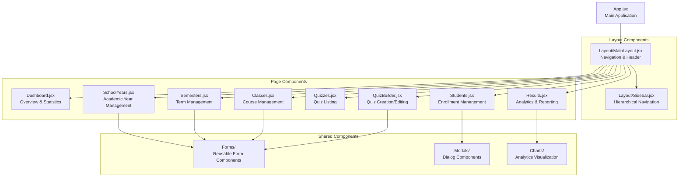

# Design Document: Hierarchical Quiz Management System

## Overview

The Hierarchical Quiz Management System is a comprehensive educational platform that enables teachers to organize academic content in a structured hierarchy (School Year → Semester → Class → Quiz) while providing students with a streamlined mobile experience. The system consists of three main components:

1. **React Web Application** - Teacher dashboard for content management
2. **Node.js/Express API** - Backend services and data management
3. **Android Mobile App** - Student interface for quiz participation

The system implements a class code-based enrollment workflow with teacher approval mechanisms, comprehensive quiz management capabilities, and real-time quiz sessions with timer functionality.

## Architecture

### System Architecture Overview



### Component Architecture

#### Frontend (React Web Application)
- **Purpose**: Teacher dashboard for managing hierarchical academic content
- **Technology Stack**: React 18, Vite, React Router, Axios, Tailwind CSS
- **Key Features**:
  - Hierarchical navigation (School Year → Semester → Class → Quiz)
  - Quiz builder with multiple question types
  - Student enrollment management
  - Real-time quiz monitoring
  - Analytics and reporting dashboard

#### Backend (Node.js/Express API)
- **Purpose**: RESTful API providing business logic and data management
- **Technology Stack**: Node.js, Express.js, MongoDB, Mongoose, JWT, Multer
- **Key Features**:
  - Authentication and authorization middleware
  - Hierarchical data management
  - Class code generation and validation
  - Quiz session management
  - File upload handling
  - Email notification system

#### Mobile App (Android)
- **Purpose**: Student interface for class enrollment and quiz participation
- **Technology Stack**: Java, Android SDK, Retrofit, Room Database
- **Key Features**:
  - Class code enrollment workflow
  - Real-time quiz taking with timer
  - Offline capability for completed quizzes
  - Push notification integration
  - Local data caching

## Components and Interfaces

### Frontend Component Hierarchy



### API Interface Design

#### Authentication Endpoints
```
POST /api/auth/register          # Teacher registration
POST /api/auth/login             # User authentication
POST /api/auth/logout            # Session termination
GET  /api/auth/profile           # User profile retrieval
PUT  /api/auth/profile           # Profile updates
```

#### Hierarchical Content Management
```
# School Years
GET    /api/school-years         # List all school years
POST   /api/school-years         # Create school year
PUT    /api/school-years/:id     # Update school year
DELETE /api/school-years/:id     # Delete school year

# Semesters
GET    /api/school-years/:id/semesters     # List semesters
POST   /api/school-years/:id/semesters     # Create semester
PUT    /api/semesters/:id                  # Update semester
DELETE /api/semesters/:id                  # Delete semester

# Classes
GET    /api/semesters/:id/classes          # List classes
POST   /api/semesters/:id/classes          # Create class
PUT    /api/classes/:id                    # Update class
DELETE /api/classes/:id                    # Delete class
POST   /api/classes/:id/regenerate-code    # Regenerate class code

# Quizzes
GET    /api/classes/:id/quizzes            # List quizzes
POST   /api/classes/:id/quizzes            # Create quiz
PUT    /api/quizzes/:id                    # Update quiz
DELETE /api/quizzes/:id                    # Delete quiz
```

#### Student Management
```
POST /api/students/register              # Student registration
POST /api/students/enroll                # Class enrollment request
GET  /api/classes/:id/enrollment-requests # Pending requests
PUT  /api/enrollment-requests/:id/approve # Approve enrollment
PUT  /api/enrollment-requests/:id/reject  # Reject enrollment
GET  /api/classes/:id/students           # Class roster
DELETE /api/classes/:classId/students/:studentId # Remove student
```

#### Quiz Operations
```
GET  /api/students/classes               # Student's enrolled classes
GET  /api/classes/:id/available-quizzes  # Available quizzes for student
POST /api/quizzes/:id/start              # Start quiz session
PUT  /api/quiz-sessions/:id/answer       # Submit answer
POST /api/quiz-sessions/:id/submit       # Submit complete quiz
GET  /api/quizzes/:id/results            # Quiz results (teacher)
GET  /api/students/quiz-results          # Student's quiz history
```

### Mobile App Architecture

#### Activity Structure
```
MainActivity
├── LoginActivity
├── RegisterActivity
├── DashboardActivity
│   ├── ClassListFragment
│   ├── QuizListFragment
│   └── ProfileFragment
├── EnrollmentActivity
├── QuizActivity
│   ├── QuestionFragment
│   └── TimerFragment
└── ResultsActivity
```

#### API Integration Layer
```java
// ApiService.java - Retrofit interface definitions
public interface ApiService {
    @POST("students/register")
    Call<AuthResponse> registerStudent(@Body StudentRegistration request);
    
    @POST("students/enroll")
    Call<EnrollmentResponse> enrollInClass(@Body EnrollmentRequest request);
    
    @GET("classes/{classId}/available-quizzes")
    Call<List<Quiz>> getAvailableQuizzes(@Path("classId") String classId);
    
    @POST("quizzes/{quizId}/start")
    Call<QuizSession> startQuiz(@Path("quizId") String quizId);
}
```

## Data Models

### Database Schema Design

#### User Collection
```javascript
{
  _id: ObjectId,
  email: String, // unique
  password: String, // hashed
  role: String, // 'teacher' | 'student'
  profile: {
    firstName: String,
    lastName: String,
    studentId: String, // for students only
    createdAt: Date,
    updatedAt: Date
  },
  isEmailVerified: Boolean,
  lastLogin: Date
}
```

#### SchoolYear Collection
```javascript
{
  _id: ObjectId,
  teacherId: ObjectId, // ref: User
  academicYear: String, // "2025-2026"
  createdAt: Date,
  updatedAt: Date
}
```

#### Semester Collection
```javascript
{
  _id: ObjectId,
  schoolYearId: ObjectId, // ref: SchoolYear
  type: String, // 'First' | 'Second' | 'Summer'
  createdAt: Date,
  updatedAt: Date
}
```

#### Class Collection
```javascript
{
  _id: ObjectId,
  semesterId: ObjectId, // ref: Semester
  teacherId: ObjectId, // ref: User
  courseCode: String,
  courseDescription: String,
  year: String, // '1st' | '2nd' | '3rd' | '4th' | '5th'
  section: String, // 'A' | 'B' | 'C' | etc.
  classCode: String, // unique, auto-generated
  enrolledStudents: [ObjectId], // ref: User
  createdAt: Date,
  updatedAt: Date
}
```

#### Quiz Collection
```javascript
{
  _id: ObjectId,
  classId: ObjectId, // ref: Class
  teacherId: ObjectId, // ref: User
  title: String,
  description: String,
  timeLimit: Number, // minutes
  randomizeQuestions: Boolean,
  availableFrom: Date,
  availableUntil: Date,
  questions: [{
    _id: ObjectId,
    type: String, // 'multiple_choice' | 'true_false' | 'short_answer' | 'essay'
    question: String,
    options: [String], // for multiple choice
    correctAnswer: String, // for objective questions
    points: Number
  }],
  isActive: Boolean,
  createdAt: Date,
  updatedAt: Date
}
```

#### EnrollmentRequest Collection
```javascript
{
  _id: ObjectId,
  studentId: ObjectId, // ref: User
  classId: ObjectId, // ref: Class
  status: String, // 'pending' | 'approved' | 'rejected'
  rejectionReason: String,
  requestedAt: Date,
  processedAt: Date,
  processedBy: ObjectId // ref: User (teacher)
}
```

#### QuizSession Collection
```javascript
{
  _id: ObjectId,
  quizId: ObjectId, // ref: Quiz
  studentId: ObjectId, // ref: User
  startedAt: Date,
  submittedAt: Date,
  timeRemaining: Number, // seconds
  answers: [{
    questionId: ObjectId,
    answer: String,
    isCorrect: Boolean, // for objective questions
    points: Number
  }],
  totalScore: Number,
  maxScore: Number,
  status: String, // 'in_progress' | 'submitted' | 'auto_submitted'
}
```

### Database Indexing Strategy

```javascript
// Performance-critical indexes
db.users.createIndex({ email: 1 }, { unique: true })
db.classes.createIndex({ classCode: 1 }, { unique: true })
db.classes.createIndex({ teacherId: 1, semesterId: 1 })
db.quizzes.createIndex({ classId: 1, isActive: 1 })
db.quizSessions.createIndex({ studentId: 1, quizId: 1 })
db.enrollmentRequests.createIndex({ classId: 1, status: 1 })

// Compound indexes for hierarchical queries
db.semesters.createIndex({ schoolYearId: 1 })
db.classes.createIndex({ semesterId: 1 })
db.quizzes.createIndex({ classId: 1 })
```

## Correctness Properties

*A property is a characteristic or behavior that should hold true across all valid executions of a system-essentially, a formal statement about what the system should do. Properties serve as the bridge between human-readable specifications and machine-verifiable correctness guarantees.*

Before defining correctness properties, I need to analyze the acceptance criteria to determine which are suitable for property-based testing.

### Property 1: Academic Year Format Validation

*For any* input string, the academic year validation function should accept strings in the format "YYYY-YYYY" where the second year is exactly one more than the first year, and reject all other formats.

**Validates: Requirements 1.1**

### Property 2: School Year Chronological Sorting

*For any* collection of school years, the system should always return them sorted in chronological order by academic year.

**Validates: Requirements 1.3**

### Property 3: Semester Type Validation

*For any* input string, the semester type validation should accept only "First", "Second", and "Summer" and reject all other values.

**Validates: Requirements 2.2**

### Property 4: Class Information Validation

*For any* class creation request, the validation should require Course Code, Course Description, Year (1st-5th), and Section, and reject requests missing any required fields.

**Validates: Requirements 3.2**

### Property 5: Class Code Generation Uniqueness

*For any* set of generated class codes, each code should be unique and follow the expected format pattern.

**Validates: Requirements 3.3**

### Property 6: Student Registration Field Validation

*For any* student registration request, the validation should require full name, email, student ID, and password, and reject incomplete requests.

**Validates: Requirements 4.2**

### Property 7: Email Format Validation

*For any* email string, the email validation function should accept valid email formats and reject invalid formats according to standard email format rules.

**Validates: Requirements 4.3**

### Property 8: Invalid Class Code Error Handling

*For any* invalid class code input, the system should return an appropriate error message indicating the code is invalid.

**Validates: Requirements 5.4**

### Property 9: Question Type Validation

*For any* question type input, the validation should accept only "multiple_choice", "true_false", "short_answer", and "essay" and reject all other values.

**Validates: Requirements 7.2**

### Property 10: Quiz Activation Validation

*For any* quiz, the activation validation should require at least one question and reject quizzes with zero questions.

**Validates: Requirements 7.5**

### Property 11: Quiz Timer Calculation

*For any* active quiz session with a time limit, the remaining time calculation should correctly compute the time left based on start time, current time, and time limit.

**Validates: Requirements 8.3**

### Property 12: Objective Question Scoring

*For any* set of objective question responses, the automatic scoring algorithm should correctly calculate the total score based on correct answers and point values.

**Validates: Requirements 8.5**

### Property 13: Quiz Timeout Auto-submission

*For any* quiz session that exceeds its time limit, the system should automatically submit the quiz with all current responses.

**Validates: Requirements 8.7**

### Property 14: Quiz Statistics Calculation

*For any* set of quiz results, the statistical calculations (average, highest, lowest scores, completion rate) should be mathematically correct.

**Validates: Requirements 9.3**

### Property 15: Teacher Authorization

*For any* request to management functions (school years, semesters, classes), the system should allow access only to authenticated users with teacher role.

**Validates: Requirements 11.1**

### Property 16: Student Enrollment Access Control

*For any* student request to view or interact with a class, the system should allow access only if the student is enrolled in that specific class.

**Validates: Requirements 11.3**

## Error Handling

### Frontend Error Handling Strategy

#### Network Error Handling
- **Connection Failures**: Display user-friendly messages and retry mechanisms
- **Timeout Handling**: Implement progressive timeout with user notification
- **API Error Responses**: Parse and display meaningful error messages from backend

#### Form Validation
- **Client-side Validation**: Immediate feedback for format and required field errors
- **Server-side Validation**: Handle and display backend validation errors
- **Async Validation**: Real-time validation for unique constraints (email, class codes)

#### State Management Errors
- **Authentication Errors**: Automatic logout and redirect to login page
- **Permission Errors**: Clear messaging about insufficient privileges
- **Data Consistency**: Refresh mechanisms for stale data detection

### Backend Error Handling Strategy

#### API Error Responses
```javascript
// Standardized error response format
{
  success: false,
  error: {
    code: "VALIDATION_ERROR",
    message: "User-friendly error message",
    details: {
      field: "email",
      reason: "Email format is invalid"
    }
  }
}
```

#### Database Error Handling
- **Connection Errors**: Retry logic with exponential backoff
- **Validation Errors**: Detailed field-level error reporting
- **Constraint Violations**: Meaningful messages for duplicate key errors
- **Transaction Failures**: Proper rollback and error reporting

#### Authentication & Authorization
- **Invalid Tokens**: Clear error messages and logout triggers
- **Expired Sessions**: Automatic token refresh or re-authentication
- **Permission Denied**: Specific error codes for different access levels

### Mobile App Error Handling

#### Network Connectivity
- **Offline Mode**: Cache essential data and queue operations
- **Poor Connection**: Adaptive timeout and retry strategies
- **API Failures**: Graceful degradation with cached data

#### Quiz Session Errors
- **Timer Synchronization**: Handle clock drift and network delays
- **Submission Failures**: Retry mechanisms with local backup
- **Session Expiry**: Clear notification and recovery options

## Testing Strategy

### Unit Testing Approach

#### Frontend Unit Tests
- **Component Testing**: React Testing Library for component behavior
- **Hook Testing**: Custom hooks with various input scenarios
- **Utility Functions**: Pure function testing with Jest
- **API Integration**: Mock API responses for service layer testing

#### Backend Unit Tests
- **Route Handlers**: Express route testing with supertest
- **Middleware Functions**: Authentication and validation middleware
- **Database Models**: Mongoose model validation and methods
- **Utility Functions**: Pure logic functions (scoring, validation, formatting)

#### Mobile App Unit Tests
- **Model Classes**: Data validation and transformation logic
- **Utility Functions**: Helper methods and calculations
- **API Client**: Mock HTTP responses for network layer
- **Local Storage**: Database operations and caching logic

### Property-Based Testing Configuration

**Testing Library**: fast-check (JavaScript/Node.js)
**Minimum Iterations**: 100 per property test
**Property Test Tags**: Each test must reference its design document property

Example property test structure:
```javascript
// Feature: hierarchical-quiz-management, Property 1: Academic Year Format Validation
fc.assert(fc.property(
  fc.string(),
  (input) => {
    const result = validateAcademicYear(input);
    const isValidFormat = /^\d{4}-\d{4}$/.test(input) && 
                         parseInt(input.split('-')[1]) === parseInt(input.split('-')[0]) + 1;
    return result.isValid === isValidFormat;
  }
), { numRuns: 100 });
```

### Integration Testing Strategy

#### API Integration Tests
- **Database Operations**: Test with real MongoDB instance
- **Authentication Flow**: End-to-end login and session management
- **File Upload**: Multipart form data handling
- **Email Services**: Mock external email service integration

#### Mobile-Backend Integration
- **API Communication**: Test mobile app API calls
- **Push Notifications**: Verify notification delivery
- **Data Synchronization**: Test offline/online data sync
- **Session Management**: Mobile authentication flow

### End-to-End Testing

#### Web Application E2E
- **Teacher Workflow**: Complete academic content creation flow
- **Student Management**: Enrollment approval process
- **Quiz Creation**: Full quiz builder functionality
- **Results Analysis**: Analytics and reporting features

#### Mobile Application E2E
- **Student Registration**: Complete onboarding flow
- **Class Enrollment**: Class code entry and approval process
- **Quiz Taking**: Full quiz session with timer
- **Results Viewing**: Score and leaderboard display

### Performance Testing

#### Load Testing Scenarios
- **Concurrent Quiz Sessions**: Multiple students taking quizzes simultaneously
- **Class Code Generation**: High-frequency unique code generation
- **Database Queries**: Hierarchical data retrieval performance
- **File Upload**: Large file handling and storage

#### Mobile Performance
- **App Launch Time**: Cold start and warm start measurements
- **Memory Usage**: Quiz data caching and cleanup
- **Battery Optimization**: Background task management
- **Network Efficiency**: Data usage optimization

### Security Testing

#### Authentication Security
- **JWT Token Validation**: Token tampering and expiry testing
- **Password Security**: Hash strength and storage validation
- **Session Management**: Concurrent session handling

#### Authorization Testing
- **Role-Based Access**: Teacher vs student permission boundaries
- **Data Isolation**: Student access to enrolled classes only
- **API Endpoint Security**: Unauthorized access prevention

#### Input Validation Security
- **SQL Injection Prevention**: Database query parameterization
- **XSS Prevention**: Input sanitization and output encoding
- **File Upload Security**: File type and size validation

## Implementation Details

### Frontend Implementation Specifications

#### State Management Strategy
```javascript
// Context-based state management for hierarchical navigation
const HierarchyContext = createContext({
  currentSchoolYear: null,
  currentSemester: null,
  currentClass: null,
  navigationPath: [],
  setCurrentLevel: () => {}
});

// Quiz builder state management
const QuizBuilderContext = createContext({
  quiz: { title: '', description: '', questions: [] },
  currentQuestion: null,
  isEditing: false,
  validationErrors: {},
  updateQuiz: () => {},
  addQuestion: () => {},
  removeQuestion: () => {}
});
```

#### Component Specifications

**SchoolYears Component**
- Display academic years in chronological order
- Implement create/edit/delete operations with confirmation dialogs
- Show semester count for each school year
- Prevent deletion if semesters exist

**QuizBuilder Component**
- Multi-step form with question type selection
- Real-time preview functionality
- Drag-and-drop question reordering
- Auto-save draft functionality
- Question validation with immediate feedback

**Students Component**
- Tabbed interface: Enrolled Students | Pending Requests
- Bulk approval/rejection actions
- Student search and filtering
- Export student list functionality

#### Responsive Design Specifications
```css
/* Mobile-first responsive breakpoints */
@media (min-width: 640px) { /* sm */ }
@media (min-width: 768px) { /* md */ }
@media (min-width: 1024px) { /* lg */ }
@media (min-width: 1280px) { /* xl */ }

/* Component-specific responsive behavior */
.quiz-builder {
  @apply grid grid-cols-1 lg:grid-cols-2 gap-6;
}

.student-management {
  @apply flex flex-col lg:flex-row;
}
```

### Backend Implementation Specifications

#### Middleware Stack
```javascript
// Authentication middleware
const authenticateToken = (req, res, next) => {
  const authHeader = req.headers['authorization'];
  const token = authHeader && authHeader.split(' ')[1];
  
  if (!token) {
    return res.status(401).json({ error: 'Access token required' });
  }
  
  jwt.verify(token, process.env.JWT_SECRET, (err, user) => {
    if (err) return res.status(403).json({ error: 'Invalid token' });
    req.user = user;
    next();
  });
};

// Role-based authorization
const requireRole = (role) => (req, res, next) => {
  if (req.user.role !== role) {
    return res.status(403).json({ error: 'Insufficient privileges' });
  }
  next();
};

// Request validation middleware
const validateRequest = (schema) => (req, res, next) => {
  const { error } = schema.validate(req.body);
  if (error) {
    return res.status(400).json({
      error: 'Validation failed',
      details: error.details.map(d => ({ field: d.path[0], message: d.message }))
    });
  }
  next();
};
```

#### Class Code Generation Algorithm
```javascript
const generateClassCode = () => {
  const characters = 'ABCDEFGHIJKLMNOPQRSTUVWXYZ0123456789';
  let result = '';
  
  // Generate 6-character alphanumeric code
  for (let i = 0; i < 6; i++) {
    result += characters.charAt(Math.floor(Math.random() * characters.length));
  }
  
  return result;
};

const ensureUniqueClassCode = async () => {
  let classCode;
  let isUnique = false;
  
  while (!isUnique) {
    classCode = generateClassCode();
    const existingClass = await Class.findOne({ classCode });
    isUnique = !existingClass;
  }
  
  return classCode;
};
```

#### Quiz Session Management
```javascript
// Quiz session controller
const startQuizSession = async (req, res) => {
  try {
    const { quizId } = req.params;
    const studentId = req.user.id;
    
    // Validate quiz availability
    const quiz = await Quiz.findById(quizId);
    if (!quiz.isActive || new Date() < quiz.availableFrom || new Date() > quiz.availableUntil) {
      return res.status(400).json({ error: 'Quiz not available' });
    }
    
    // Check for existing session
    const existingSession = await QuizSession.findOne({ quizId, studentId });
    if (existingSession) {
      return res.status(400).json({ error: 'Quiz already taken' });
    }
    
    // Create new session
    const session = new QuizSession({
      quizId,
      studentId,
      startedAt: new Date(),
      timeRemaining: quiz.timeLimit * 60, // Convert minutes to seconds
      answers: [],
      status: 'in_progress'
    });
    
    await session.save();
    res.json({ sessionId: session._id, timeRemaining: session.timeRemaining });
  } catch (error) {
    res.status(500).json({ error: 'Failed to start quiz session' });
  }
};
```

### Mobile App Implementation Specifications

#### Android Architecture Components

**MainActivity Structure**
```java
public class MainActivity extends AppCompatActivity {
    private BottomNavigationView bottomNavigation;
    private FragmentManager fragmentManager;
    
    @Override
    protected void onCreate(Bundle savedInstanceState) {
        super.onCreate(savedInstanceState);
        setContentView(R.layout.activity_main);
        
        setupBottomNavigation();
        loadInitialFragment();
        checkAuthenticationStatus();
    }
    
    private void setupBottomNavigation() {
        bottomNavigation = findViewById(R.id.bottom_navigation);
        bottomNavigation.setOnItemSelectedListener(this::onNavigationItemSelected);
    }
}
```

**Quiz Taking Activity**
```java
public class QuizActivity extends AppCompatActivity {
    private Quiz currentQuiz;
    private QuizSession session;
    private List<Question> questions;
    private int currentQuestionIndex = 0;
    private CountDownTimer quizTimer;
    
    @Override
    protected void onCreate(Bundle savedInstanceState) {
        super.onCreate(savedInstanceState);
        setContentView(R.layout.activity_quiz);
        
        initializeQuiz();
        startTimer();
        loadQuestion(currentQuestionIndex);
    }
    
    private void startTimer() {
        long timeInMillis = session.getTimeRemaining() * 1000;
        quizTimer = new CountDownTimer(timeInMillis, 1000) {
            @Override
            public void onTick(long millisUntilFinished) {
                updateTimerDisplay(millisUntilFinished);
            }
            
            @Override
            public void onFinish() {
                autoSubmitQuiz();
            }
        }.start();
    }
}
```

#### Local Data Caching Strategy
```java
// Room Database entities
@Entity(tableName = "cached_quizzes")
public class CachedQuiz {
    @PrimaryKey
    public String quizId;
    public String title;
    public String classId;
    public long cachedAt;
    public String questionsJson;
}

@Entity(tableName = "quiz_results")
public class QuizResult {
    @PrimaryKey
    public String sessionId;
    public String quizId;
    public String studentId;
    public int score;
    public int maxScore;
    public long completedAt;
    public boolean synced;
}

// Data Access Object
@Dao
public interface QuizDao {
    @Query("SELECT * FROM cached_quizzes WHERE classId = :classId")
    List<CachedQuiz> getQuizzesForClass(String classId);
    
    @Query("SELECT * FROM quiz_results WHERE synced = 0")
    List<QuizResult> getUnsyncedResults();
    
    @Insert(onConflict = OnConflictStrategy.REPLACE)
    void cacheQuiz(CachedQuiz quiz);
}
```

#### Push Notification Integration
```java
public class QuizFirebaseMessagingService extends FirebaseMessagingService {
    @Override
    public void onMessageReceived(RemoteMessage remoteMessage) {
        super.onMessageReceived(remoteMessage);
        
        String notificationType = remoteMessage.getData().get("type");
        
        switch (notificationType) {
            case "quiz_available":
                showQuizAvailableNotification(remoteMessage.getData());
                break;
            case "enrollment_approved":
                showEnrollmentApprovedNotification(remoteMessage.getData());
                break;
            case "enrollment_rejected":
                showEnrollmentRejectedNotification(remoteMessage.getData());
                break;
        }
    }
    
    private void showQuizAvailableNotification(Map<String, String> data) {
        NotificationCompat.Builder builder = new NotificationCompat.Builder(this, CHANNEL_ID)
            .setSmallIcon(R.drawable.ic_quiz)
            .setContentTitle("New Quiz Available")
            .setContentText(data.get("quizTitle") + " is now available")
            .setPriority(NotificationCompat.PRIORITY_HIGH)
            .setAutoCancel(true);
            
        NotificationManagerCompat.from(this).notify(QUIZ_NOTIFICATION_ID, builder.build());
    }
}
```

### Database Optimization Strategies

#### Connection Pool Configuration
```javascript
// MongoDB connection with optimized settings
const mongoOptions = {
  maxPoolSize: 10, // Maximum number of connections
  serverSelectionTimeoutMS: 5000, // How long to try selecting a server
  socketTimeoutMS: 45000, // How long a send or receive on a socket can take
  bufferMaxEntries: 0, // Disable mongoose buffering
  bufferCommands: false, // Disable mongoose buffering
  useNewUrlParser: true,
  useUnifiedTopology: true
};

mongoose.connect(process.env.MONGODB_URI, mongoOptions);
```

#### Query Optimization Patterns
```javascript
// Efficient hierarchical data retrieval
const getClassHierarchy = async (classId) => {
  return await Class.aggregate([
    { $match: { _id: ObjectId(classId) } },
    {
      $lookup: {
        from: 'semesters',
        localField: 'semesterId',
        foreignField: '_id',
        as: 'semester'
      }
    },
    {
      $lookup: {
        from: 'schoolyears',
        localField: 'semester.schoolYearId',
        foreignField: '_id',
        as: 'schoolYear'
      }
    },
    { $unwind: '$semester' },
    { $unwind: '$schoolYear' }
  ]);
};

// Optimized quiz results aggregation
const getQuizStatistics = async (quizId) => {
  return await QuizSession.aggregate([
    { $match: { quizId: ObjectId(quizId), status: 'submitted' } },
    {
      $group: {
        _id: null,
        averageScore: { $avg: '$totalScore' },
        highestScore: { $max: '$totalScore' },
        lowestScore: { $min: '$totalScore' },
        totalSubmissions: { $sum: 1 }
      }
    }
  ]);
};
```

### Security Implementation

#### Password Security
```javascript
const bcrypt = require('bcrypt');
const SALT_ROUNDS = 12;

const hashPassword = async (password) => {
  return await bcrypt.hash(password, SALT_ROUNDS);
};

const validatePassword = async (password, hashedPassword) => {
  return await bcrypt.compare(password, hashedPassword);
};
```

#### JWT Token Management
```javascript
const generateTokens = (user) => {
  const accessToken = jwt.sign(
    { id: user._id, email: user.email, role: user.role },
    process.env.JWT_SECRET,
    { expiresIn: '15m' }
  );
  
  const refreshToken = jwt.sign(
    { id: user._id },
    process.env.REFRESH_TOKEN_SECRET,
    { expiresIn: '7d' }
  );
  
  return { accessToken, refreshToken };
};
```

#### Input Sanitization
```javascript
const sanitizeInput = (input) => {
  if (typeof input === 'string') {
    return input.trim().replace(/<script\b[^<]*(?:(?!<\/script>)<[^<]*)*<\/script>/gi, '');
  }
  return input;
};

// Middleware for request sanitization
const sanitizeRequest = (req, res, next) => {
  if (req.body) {
    req.body = sanitizeObject(req.body);
  }
  if (req.query) {
    req.query = sanitizeObject(req.query);
  }
  next();
};
```

### Deployment and Scalability Considerations

#### Environment Configuration
```javascript
// Production environment variables
const config = {
  PORT: process.env.PORT || 3000,
  MONGODB_URI: process.env.MONGODB_URI,
  JWT_SECRET: process.env.JWT_SECRET,
  REFRESH_TOKEN_SECRET: process.env.REFRESH_TOKEN_SECRET,
  EMAIL_SERVICE_API_KEY: process.env.EMAIL_SERVICE_API_KEY,
  FIREBASE_SERVER_KEY: process.env.FIREBASE_SERVER_KEY,
  REDIS_URL: process.env.REDIS_URL,
  NODE_ENV: process.env.NODE_ENV || 'development'
};
```

#### Caching Strategy
```javascript
const redis = require('redis');
const client = redis.createClient(process.env.REDIS_URL);

// Cache frequently accessed data
const cacheQuizData = async (quizId, data) => {
  await client.setex(`quiz:${quizId}`, 3600, JSON.stringify(data)); // 1 hour TTL
};

const getCachedQuizData = async (quizId) => {
  const cached = await client.get(`quiz:${quizId}`);
  return cached ? JSON.parse(cached) : null;
};
```

#### Load Balancing Considerations
- **Stateless API Design**: All session data stored in database/cache
- **Database Connection Pooling**: Optimized connection management
- **CDN Integration**: Static asset delivery optimization
- **Horizontal Scaling**: Container-based deployment with load balancers

This comprehensive design document provides the technical foundation for implementing the Hierarchical Quiz Management System with proper architecture, security, performance, and scalability considerations.